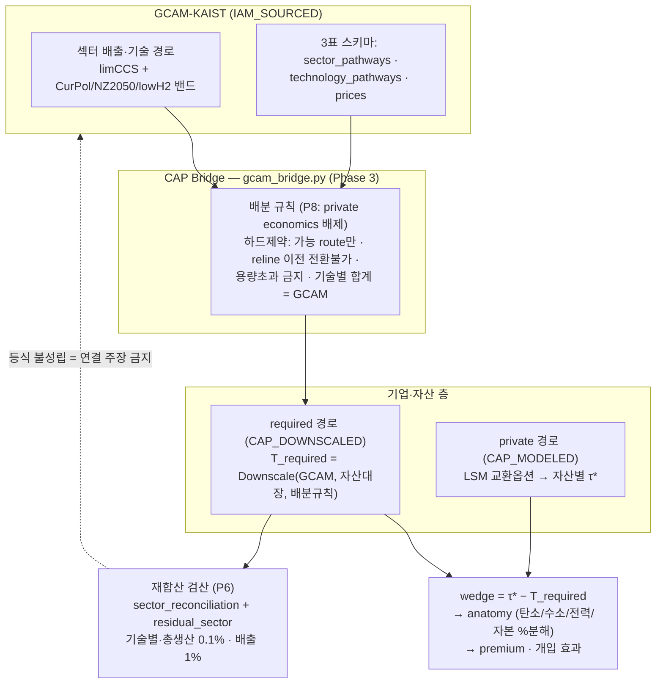
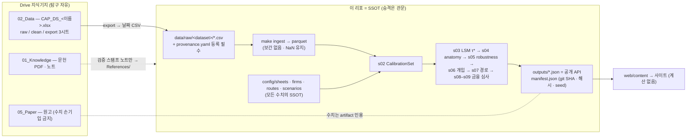

# LOGIC_MAP — CAP과 GCAM의 보완 구조, 데이터 흐름, 시각 산출물

> 2026-08-01, 업데이트 계획 v4 기준. 상세 파이프라인은 [ARCHITECTURE.md](../ARCHITECTURE.md),
> 승격 규약은 [CONTRIBUTING.md](../CONTRIBUTING.md) / [DATA_INTERFACE.md](../DATA_INTERFACE.md)가 정본.

**한 줄 정의 (v4).** CAP은 GCAM 섹터 경로를 자산·기업에 배분하고, 사적(private) 경로와
비교해 필요 조건을 역산하며, 다시 섹터로 재합산해 검산하는 **번역·정렬 엔진**이다.
GCAM은 섹터까지만 안다 — 기업과 설비가 없다. 그 missing middle이 CAP의 자리다.

## 1. GCAM 브리지

경로 3종 분리(P7): `gcam_sector_pathway`(IAM_SOURCED) / `required_*_pathway`(CAP_DOWNSCALED)
/ `private_*_pathway`(CAP_MODELED). required 배분에 private economics 금지(P8),
재합산 등식 없이는 "GCAM과 연결됐다" 주장 금지(P6).

현재 GCAM 원시 데이터 미도착(`data/raw/gcam/MISSING.md`), `scenario=surrogate`로 구동.
도착 시 곡선만 교체하고 **순위 안정성 테스트가 헤드라인 robustness**가 된다(Phase 4-1).

## 2. 데이터 흐름 — Drive 지식기지 → 리포 → 산출물

| 승격 레인 | 관문 |
|---|---|
| 데이터 | export 시트 → 날짜 CSV → `data/raw/` + provenance 등록 → `make ingest` (미등록 파일 실패) |
| 파라미터 | `DECISIONS.md` 등록 → 결정 → config 반영 → `PAPER_DIFF.md` 기록 |
| 이론·주장 | anchor ID + config 역참조 + 테스트 — 양방향 검사 깨지면 빌드 실패 |
| 문헌 | PDF는 Drive 보관, 리포에는 검증 스탬프 노트만 (`References/`) |

## 3. 시각 산출물 (Phase 5)

시각 규약: required **진녹 실선+밴드** / private **주황** / intervention **파랑 점선** /
BAU **회색** / gap 반투명 면적 / residual 회색 사선 / surrogate=회색·점선, GCAM=실선·유색 /
동일 축(2025–2050) / 경로 차트 뒤 reconciliation 필수.

1. **그림 1 "척추"** — 상단 GCAM 배치곡선 vs 사적 집계(음영=섹터 gap), 하단 기업별 stacked 분해.
2. **그림 2 자산 타임라인(Gantt)** — 고로별 reline 창 + τ* + T_required 한 축, censored는 "≥" 화살표.
3. **그림 3 탄소가격 사다리** — 현물 → 시나리오 → CBAM → shadow price, 국가별 세로축.

덱 8단: GCAM 도착점 → missing middle → bridge 구조도 → 기업 small multiples →
자산 타임라인 → gap waterfall → reconciliation 패널 → 정책 수렴.

### artifact ↔ 그림 매핑

| 스테이지 | artifact | 시각물 |
|---|---|---|
| s03 | `tau_star` · `wedge` | 그림 2 마커 (CAP_MODELED) |
| s02+bridge | `calibration_resolved` · (신설) `sector_reconciliation` | 그림 1 상단 · reconciliation 패널 |
| s04 | `shares_by_firm` · `premium_levels` · `stranding` | anatomy stacked bar · 프리미엄 표 |
| s05 | `share_envelopes` · `lambda_invariance` · `cluster_separation` | envelope 밴드 · P1 불변성 그리드 |
| s06–s07 | `intervention_impacts` · `emissions_pathways_by_firm` · `condition_gap` | 그림 1 하단 · gap waterfall |
| s08–s09 | `transition_underwriting` · `deal_screening` | 스프레드 표면 · 딜 스크린 표 |
